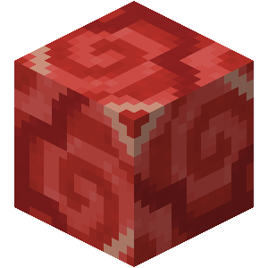

# Terracotta | 陶瓦联机

  

## 项目简介

Terracotta（陶瓦联机）是一个专门为 Minecraft 多人联机优化的解决方案。该项目基于 EasyTier 技术，通过深度优化，为玩家提供更流畅、便捷的 MC 联机体验。

## 主要特点

- 基于 EasyTier 技术架构
- 针对 Minecraft 进行深度优化
- 简化联机流程
- 提供稳定的多人游戏体验

## 未来展望

本项目作为技术探索和实践的平台，未来将与 HMCL（Hello Minecraft! Launcher）展开深度合作。在技术方案完全成熟后，HMCL 开发团队计划将 Terracotta 的全部功能整合到启动器中，为更广大的 Minecraft 玩家群体提供优质的联机服务。

## 技术愿景

- 持续优化联机性能
- 提升用户体验
- 与主流启动器深度整合
- 为 Minecraft 多人游戏生态贡献力量

## 参与贡献

我们欢迎社区成员参与项目开发和改进。如果您对项目感兴趣，可以通过以下方式参与：

- 提交 Issue 反馈问题
- 提供功能建议
- 参与代码贡献
- 完善项目文档

## 相关链接

- [项目 GitHub 仓库](#)
- [问题反馈](#)
- [开发文档](#)
- [HMCL 官网](#)

---

> Terracotta 项目正在积极开发中，我们期待您的参与和建议！