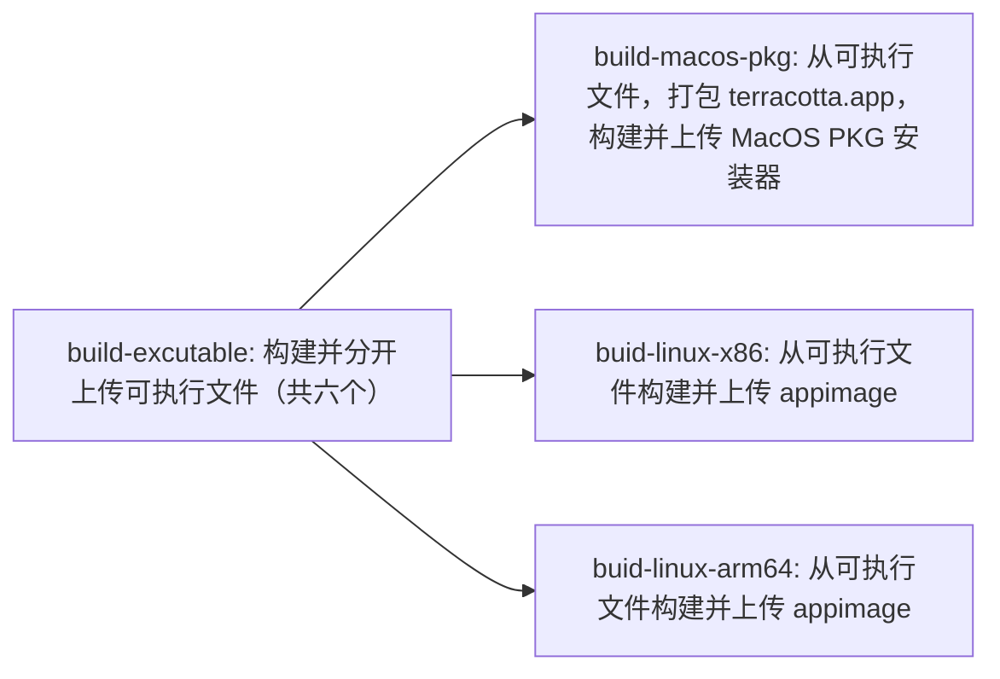

# Welcome to Terracotta Documentation

This is the main page of the documentation.

```mermaid
graph LR

build[build-excutable: 构建并分开上传可执行文件（共六个）] --> macos[build-macos-pkg: 从可执行文件，打包 terracotta.app，构建并上传 MacOS PKG 安装器]
build --> linux-x86[buid-linux-x86: 从可执行文件构建并上传 appimage]
build --> linux-arm64[buid-linux-arm64: 从可执行文件构建并上传 appimage]
```